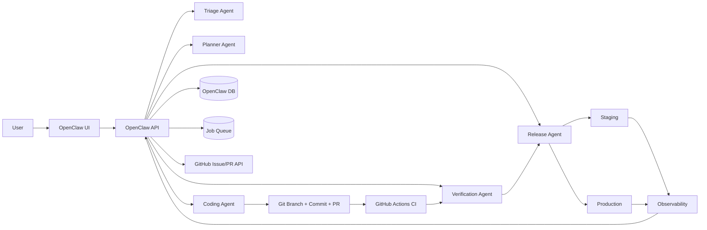
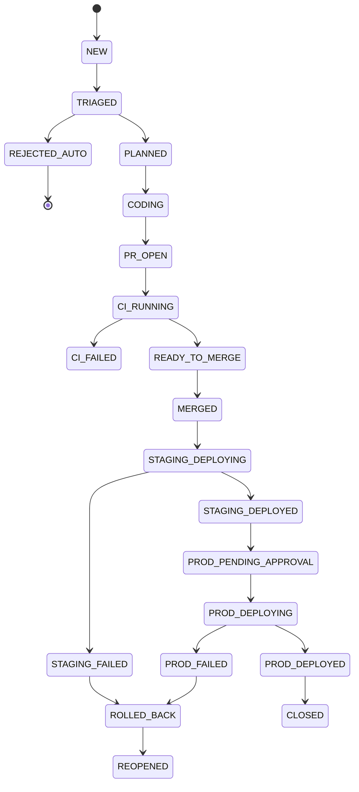
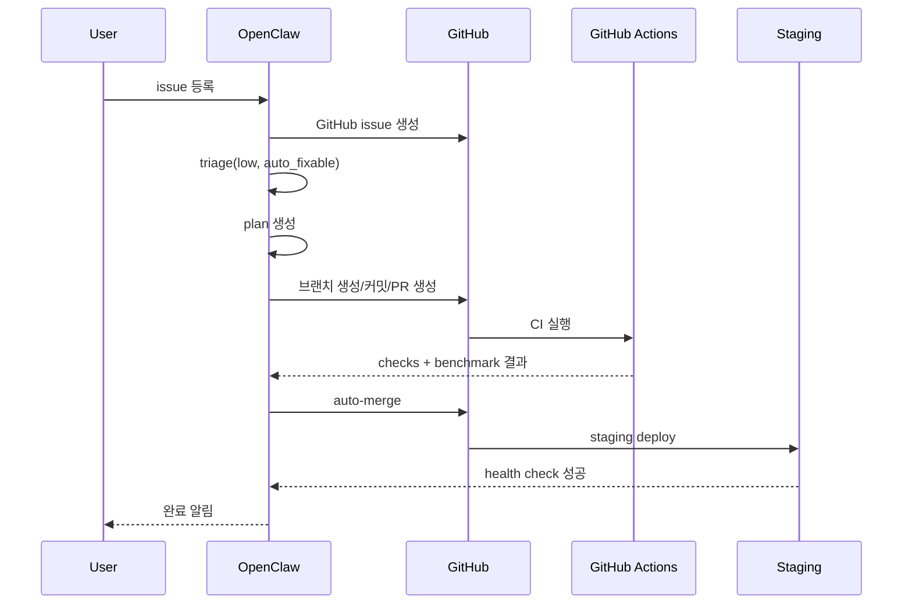

# AgentNav Auto-Pilot 설계안

> 목적: **OpenClaw(오픈클로)** 를 control plane으로 두고, 사용자가 OpenClaw에서 이슈를 등록하면 AgentNav 저장소의 변경, 검증, PR 생성, 스테이징 배포, 프로덕션 승인 배포까지 이어지는 운영 구조를 설계한다.

---

## 0. 요약

### 한 줄 결론
가능하다. 다만 **GitHub가 자동화를 주도하는 구조가 아니라, OpenClaw가 상태 머신과 의사결정을 소유하고 GitHub는 코드/CI 실행 기반으로 쓰는 구조**가 가장 현실적이다.

### 권장 운영 원칙
- **OpenClaw = 운영 두뇌(Control Plane)**
- **GitHub = 코드 저장소 + CI/CD 실행기**
- **Agent = 이슈 분석/수정/검증/배포 판단 수행자**
- **Staging 자동, Production 승인형**

### 현실적인 자동화 범위
- 자동 이슈 분류: 가능
- 자동 수정 + PR 생성: 가능
- 자동 스테이징 배포: 가능
- 완전 무인 프로덕션 배포: 권장하지 않음

---

## 1. 목표와 비목표

### 목표
1. 사용자는 **OpenClaw UI** 에서만 이슈를 등록한다.
2. OpenClaw가 이슈를 정규화하고 GitHub issue/branch/PR/deploy를 조율한다.
3. low-risk 변경은 PR 생성과 staging 배포까지 자동 진행한다.
4. AgentNav 특성상 **navigation regression** 을 배포 게이트에 포함한다.
5. 모든 판단 근거를 OpenClaw에 저장해 재현성과 감사 추적성을 확보한다.

### 비목표
- 첫 버전부터 완전 무인 prod 배포
- 복잡한 모델 교체나 대규모 아키텍처 변경의 자동 처리
- 사람 검토 없이 성능 저하 가능성이 있는 변경의 자동 머지

---

## 2. 전제와 가정

### 전제
- OpenClaw는 API 호출, 비동기 job 실행, 상태 저장이 가능하다.
- GitHub App 또는 동등한 machine identity를 사용할 수 있다.
- AgentNav 저장소에 GitHub Actions를 추가할 수 있다.
- staging/prod 배포 타깃이 분리 가능하다.

### 설계 가정
- 사용자가 등록하는 이슈는 OpenClaw 내부 템플릿을 통해 최소 구조화된다.
- 저장소 자동 수정은 **PR 기반** 으로만 진행하며 `main` 직접 push는 금지한다.
- AgentNav는 외부 API/LLM 영향을 받으므로, 단순 unit test 외에 smoke/benchmark 게이트가 필요하다.

---

## 3. 상위 아키텍처



### 핵심 구조
- **OpenClaw API**: 모든 workflow 진입점
- **Job Queue**: 장시간 작업 비동기화
- **Agent Layer**: triage / planning / coding / verification / release
- **GitHub Integration**: issue, branch, PR, check-run, environment deployment
- **Observability Layer**: 배포 후 상태/비용/성능 수집

---

## 4. 운영 상태 머신

이슈별 workflow 상태를 OpenClaw가 소유한다.



### 상태 정의
| 상태 | 의미 |
|---|---|
| `NEW` | OpenClaw UI에서 신규 접수 |
| `TRIAGED` | 자동 분류/위험도/자동화 가능성 판정 완료 |
| `REJECTED_AUTO` | 자동 처리 부적합, 사람 검토 큐 이동 |
| `PLANNED` | 수정 범위/검증 계획 수립 |
| `CODING` | agent가 브랜치에서 구현 중 |
| `PR_OPEN` | PR 생성 완료 |
| `CI_RUNNING` | GitHub Actions 검증 중 |
| `CI_FAILED` | 검증 실패, 재수정 루프 가능 |
| `READY_TO_MERGE` | 자동 머지 또는 승인 대기 |
| `MERGED` | 기본 브랜치 반영 완료 |
| `STAGING_DEPLOYED` | staging 배포 및 헬스체크 성공 |
| `PROD_PENDING_APPROVAL` | production 배포 승인 대기 |
| `PROD_DEPLOYED` | production 배포 완료 |
| `ROLLED_BACK` | 자동/수동 롤백 수행 |

---

## 5. 오픈클로 내부 서비스 설계

### 5.1 Issue Intake Service
역할:
- 사용자 입력 수집
- 템플릿 검증
- 중복 이슈 탐지
- GitHub issue 생성

입력 권장 필드:
- `title`
- `type`: `bug | feature | chore | docs | infra`
- `summary`
- `expected_behavior`
- `repro_steps`
- `logs`
- `attachments`
- `priority`
- `target_env`: `dev | staging | prod`
- `auto_fix_opt_in`: boolean

처리:
- 템플릿 누락 필드 보완 요청
- 유사 issue 탐지(임베딩/키워드)
- GitHub issue body 정규화

---

### 5.2 Triage Agent
역할:
- 이슈 라벨링
- 자동화 가능성 판정
- 위험도 산정
- 필요한 검증 강도 판정

출력 스키마:
```json
{
  "issue_id": "ISS-1024",
  "github_issue_number": 87,
  "classification": "bug",
  "risk": "low",
  "auto_fixable": true,
  "needs_human": false,
  "required_checks": ["lint", "unit", "smoke", "nav-benchmark"],
  "merge_policy": "auto-if-green",
  "deploy_policy": "staging-auto-prod-approval"
}
```

판정 기준 예시:
- **low**: docs, config, 소규모 버그, 에러 메시지 개선
- **medium**: 로직 수정, 테스트 보강, CLI 변경
- **high**: 모델/프롬프트 핵심 변경, 외부 API 흐름 변경, 보안/권한, 배포 파이프라인 변경

---

### 5.3 Planner Agent
역할:
- 변경 범위 명세
- 예상 영향 파일 예측
- 검증 계획 생성
- 머지/배포 정책 초안 생성

출력 예시:
```json
{
  "issue_id": "ISS-1024",
  "plan_summary": "좌회전 판단 로직의 heading threshold를 조정하고 회귀 테스트를 추가",
  "candidate_files": [
    "src/navigation/policy.py",
    "src/navigation/heading.py",
    "tests/test_turn_decision.py"
  ],
  "test_plan": {
    "unit": ["turn threshold edge cases"],
    "integration": ["CLI single route smoke"],
    "benchmark": ["seoul_5_routes_baseline"]
  },
  "rollback_plan": "기존 stable tag로 rollback"
}
```

---

### 5.4 Coding Agent
역할:
- 브랜치 생성
- 코드 수정
- 테스트 추가/수정
- 커밋/푸시
- PR 생성

브랜치 규칙:
- `openclaw/issue-87-bug-left-turn-threshold`

PR 템플릿 필수 항목:
- 변경 요약
- 근본 원인
- 수정 전략
- 테스트 결과
- benchmark 결과
- 리스크
- 배포 권장 레벨

자동화 제약:
- `main` 직접 push 금지
- 반드시 PR 경유
- 보호 브랜치 룰 준수

---

### 5.5 Verification Agent
역할:
- CI 결과 수집
- 실패 로그 분석
- 재수정 루프 관리
- 성능/비용 임계치 판정

재수정 루프 정책:
- 최대 2~3회 자동 재시도
- 동일 failure signature 반복 시 사람 검토 큐 이동

판정 출력 예시:
```json
{
  "pr_number": 154,
  "status": "pass",
  "checks": {
    "lint": "pass",
    "typecheck": "pass",
    "unit": "pass",
    "smoke": "pass",
    "nav-benchmark": "pass"
  },
  "benchmark_delta": {
    "success_rate": "+1.8%",
    "avg_steps": "-0.4",
    "avg_cost": "+3.2%"
  },
  "merge_allowed": true,
  "staging_allowed": true
}
```

---

### 5.6 Release Agent
역할:
- staging 배포 실행
- 헬스체크
- canary/prod 승인 요청
- 롤백 수행

정책:
- `staging`: 조건 충족 시 자동
- `production`: 기본 승인형
- 실패 시 stable tag/image로 rollback

---

### 5.7 Audit & Memory Service
역할:
- 의사결정 근거 저장
- 동일 유형 이슈 재활용
- agent 성능/성공률 추적

저장할 항목:
- triage 결과
- plan 버전
- patch 요약
- test 결과
- benchmark 변화
- 배포/롤백 이력

---

## 6. OpenClaw API 초안

### 6.1 Issue 생성
`POST /api/issues`

요청:
```json
{
  "title": "[bug] 좌회전 판단 실패",
  "type": "bug",
  "summary": "특정 교차로에서 좌회전 대신 직진 선택",
  "expected_behavior": "교차로 heading 변화가 큰 경우 좌회전 선택",
  "repro_steps": [
    "route_id=seoul_001 실행",
    "step 8에서 잘못된 action 확인"
  ],
  "priority": "high",
  "target_env": "staging",
  "auto_fix_opt_in": true
}
```

응답:
```json
{
  "issue_id": "ISS-1024",
  "status": "NEW",
  "github_issue_number": 87
}
```

### 6.2 이슈 상태 조회
`GET /api/issues/{issue_id}`

응답:
```json
{
  "issue_id": "ISS-1024",
  "status": "CI_RUNNING",
  "risk": "low",
  "github": {
    "issue_number": 87,
    "branch": "openclaw/issue-87-bug-left-turn-threshold",
    "pr_number": 154
  },
  "timeline": [
    {"at": "2026-03-12T10:00:00Z", "event": "TRIAGED"},
    {"at": "2026-03-12T10:04:00Z", "event": "PLANNED"},
    {"at": "2026-03-12T10:15:00Z", "event": "PR_OPEN"}
  ]
}
```

### 6.3 수동 승인
`POST /api/issues/{issue_id}/approve`

요청:
```json
{
  "scope": "production-deploy",
  "approved_by": "owner@company.com",
  "comment": "benchmark acceptable; proceed"
}
```

### 6.4 롤백 요청
`POST /api/deployments/{deployment_id}/rollback`

요청:
```json
{
  "reason": "post-deploy health check failure"
}
```

### 6.5 GitHub webhook 수신
`POST /api/webhooks/github`

수신 이벤트:
- `issues`
- `issue_comment`
- `pull_request`
- `check_suite`
- `check_run`
- `deployment_status`

---

## 7. 내부 이벤트 스키마

OpenClaw는 내부 이벤트 버스를 두는 것이 좋다.

### 이벤트 예시
```json
{
  "event_type": "issue.triaged",
  "event_id": "evt_001",
  "occurred_at": "2026-03-12T10:03:10Z",
  "issue_id": "ISS-1024",
  "payload": {
    "risk": "low",
    "auto_fixable": true,
    "required_checks": ["lint", "unit", "smoke", "nav-benchmark"]
  }
}
```

권장 이벤트 목록:
- `issue.created`
- `issue.triaged`
- `issue.planned`
- `coding.started`
- `pr.created`
- `ci.started`
- `ci.failed`
- `ci.passed`
- `merge.completed`
- `deploy.staging.started`
- `deploy.staging.succeeded`
- `deploy.prod.requested`
- `deploy.prod.succeeded`
- `deploy.failed`
- `rollback.completed`

---

## 8. DB 스키마 초안

### 8.1 `issues`
| 컬럼 | 타입 | 설명 |
|---|---|---|
| `id` | uuid | OpenClaw issue id |
| `github_issue_number` | int | GitHub issue 번호 |
| `title` | text | 제목 |
| `type` | text | bug/feature/chore/docs/infra |
| `status` | text | 상태 머신 값 |
| `risk` | text | low/medium/high |
| `auto_fixable` | bool | 자동 수정 가능 여부 |
| `target_env` | text | dev/staging/prod |
| `created_by` | text | 사용자 |
| `created_at` | timestamptz | 생성 시각 |
| `updated_at` | timestamptz | 수정 시각 |

### 8.2 `issue_runs`
| 컬럼 | 타입 | 설명 |
|---|---|---|
| `id` | uuid | 실행 id |
| `issue_id` | uuid | FK |
| `phase` | text | triage/planning/coding/verify/release |
| `status` | text | running/succeeded/failed |
| `agent_name` | text | 수행 agent |
| `started_at` | timestamptz | 시작 |
| `ended_at` | timestamptz | 종료 |
| `summary` | jsonb | 요약 |
| `artifacts` | jsonb | 로그/링크 |

### 8.3 `plans`
| 컬럼 | 타입 | 설명 |
|---|---|---|
| `id` | uuid | plan id |
| `issue_id` | uuid | FK |
| `version` | int | 버전 |
| `content_markdown` | text | plan 본문 |
| `candidate_files` | jsonb | 예상 영향 파일 |
| `test_plan` | jsonb | 테스트 계획 |
| `approved` | bool | 승인 여부 |

### 8.4 `pull_requests`
| 컬럼 | 타입 | 설명 |
|---|---|---|
| `id` | uuid | row id |
| `issue_id` | uuid | FK |
| `github_pr_number` | int | PR 번호 |
| `branch_name` | text | 브랜치 |
| `merge_commit_sha` | text | 머지 SHA |
| `status` | text | open/merged/closed |
| `ci_status` | text | pending/pass/fail |

### 8.5 `deployments`
| 컬럼 | 타입 | 설명 |
|---|---|---|
| `id` | uuid | deployment id |
| `issue_id` | uuid | FK |
| `environment` | text | staging/prod |
| `artifact_version` | text | image tag / commit SHA |
| `status` | text | pending/running/succeeded/failed/rolled_back |
| `health_summary` | jsonb | 헬스체크 |
| `rollback_of` | uuid | 이전 deployment 참조 |

### 8.6 `benchmarks`
| 컬럼 | 타입 | 설명 |
|---|---|---|
| `id` | uuid | benchmark id |
| `pr_id` | uuid | FK |
| `suite_name` | text | 예: nav-smoke, city-baseline |
| `success_rate` | numeric | 성공률 |
| `avg_steps` | numeric | 평균 step |
| `avg_cost` | numeric | 평균 비용 |
| `avg_latency_ms` | numeric | 평균 지연 |
| `raw_report` | jsonb | 원본 결과 |

---

## 9. GitHub 연동 설계

### 9.1 권한 방식
권장: **GitHub App**

필요 권한:
- Issues: read/write
- Pull requests: read/write
- Contents: read/write (브랜치 작업 범위)
- Checks: read
- Actions: read
- Deployments: read/write
- Metadata: read

비권장:
- owner 개인 PAT 상시 사용

### 9.2 브랜치 보호 정책
- `main` 보호 브랜치
- required checks 통과 필수
- direct push 금지
- squash merge 또는 merge queue 사용 권장

### 9.3 PR 라벨 전략
- `openclaw:auto`
- `risk:low|medium|high`
- `type:bug|feature|docs|infra`
- `deploy:staging-auto`
- `deploy:prod-approval`
- `needs-human`

---

## 10. GitHub Actions 설계

### 10.1 `ci.yml`
목적:
- lint
- typecheck
- unit test
- integration smoke
- navigation benchmark

예시:
```yaml
name: ci

on:
  pull_request:
  push:
    branches: [main]

jobs:
  validate:
    runs-on: ubuntu-latest
    timeout-minutes: 45
    steps:
      - uses: actions/checkout@v4
      - uses: actions/setup-python@v5
        with:
          python-version: '3.11'
      - name: Install
        run: |
          pip install -r requirements.txt
          pip install -r requirements-dev.txt || true
      - name: Lint
        run: make lint
      - name: Typecheck
        run: make typecheck
      - name: Unit tests
        run: make test
      - name: Smoke test
        run: python scripts/run_smoke.py --suite quick
      - name: Navigation benchmark
        run: python scripts/run_nav_benchmark.py --suite pr-gate --output report.json
      - name: Upload report
        uses: actions/upload-artifact@v4
        with:
          name: nav-benchmark-report
          path: report.json
```

### 10.2 `pr-summary.yml`
목적:
- benchmark delta를 PR 코멘트로 게시
- OpenClaw webhook 소비를 쉽게 함

예시:
```yaml
name: pr-summary

on:
  workflow_run:
    workflows: [ci]
    types: [completed]

jobs:
  summarize:
    if: ${{ github.event.workflow_run.conclusion == 'success' }}
    runs-on: ubuntu-latest
    steps:
      - name: Post summary
        run: echo "Post benchmark summary to PR via gh api or script"
```

### 10.3 `deploy-staging.yml`
목적:
- merge 후 staging 자동 배포

예시:
```yaml
name: deploy-staging

on:
  workflow_dispatch:
    inputs:
      sha:
        required: true
  push:
    branches: [main]

jobs:
  deploy:
    environment: staging
    runs-on: ubuntu-latest
    steps:
      - uses: actions/checkout@v4
      - name: Deploy to staging
        run: ./scripts/deploy_staging.sh ${GITHUB_SHA}
      - name: Health check
        run: ./scripts/healthcheck_staging.sh
```

### 10.4 `deploy-prod.yml`
목적:
- GitHub Environment approval 기반 prod 배포

예시:
```yaml
name: deploy-prod

on:
  workflow_dispatch:
    inputs:
      sha:
        required: true

jobs:
  deploy:
    environment: production
    runs-on: ubuntu-latest
    steps:
      - uses: actions/checkout@v4
      - name: Deploy to production
        run: ./scripts/deploy_prod.sh ${{ inputs.sha }}
      - name: Health check
        run: ./scripts/healthcheck_prod.sh
```

---

## 11. AgentNav 특화 검증 설계

AgentNav 유형의 프로젝트는 일반 CRUD 서비스와 다르다. 따라서 아래 4단 검증이 필요하다.

### 11.1 Static checks
- lint
- typecheck
- import graph 오류
- config validation

### 11.2 Functional smoke
- CLI 진입 확인
- 필수 env 누락 시 graceful fail
- 단일 route 실행 시 crash 없음
- 결과 artifact 생성 확인

### 11.3 Navigation regression
필수 지표:
- `success_rate`
- `avg_steps`
- `avg_cost`
- `avg_latency_ms`
- `crash_count`

권장 benchmark suite:
- 도시 3개
- route pair 5~10개
- 고정 seed 가능 시 고정
- 동일 모델/동일 환경변수 사용

배포 차단 기준 예시:
- success_rate 5%p 이상 하락 시 차단
- avg_cost 20% 이상 상승 시 경고 또는 차단
- crash 1건 이상 발생 시 차단
- latency 30% 이상 상승 시 수동 승인 전환

### 11.4 Post-deploy checks
- staging smoke rerun
- prod health endpoint
- 에러율/비용 모니터링
- 일정 시간 canary 관찰

---

## 12. 자동화 정책 매트릭스

| 변경 유형 | Auto PR | Auto Merge | Staging Auto Deploy | Prod Auto Deploy |
|---|---:|---:|---:|---:|
| docs | O | O | O | X |
| chore/config | O | O | O | X |
| low-risk bug | O | O | O | X |
| medium bug | O | △ | O | X |
| feature | O | X | △ | X |
| infra | △ | X | X | X |
| security/model core | X | X | X | X |

설명:
- `O`: 기본 허용
- `△`: 조건부 허용
- `X`: 사람 승인 필수

---

## 13. 롤백 설계

### 롤백 트리거
- 배포 후 health check 실패
- 에러율 급증
- benchmark degraded
- API 비용 급등
- 주요 기능 crash

### 롤백 방식
1. 현재 배포 SHA/image 식별
2. 이전 stable artifact 배포
3. deployment 상태 `ROLLED_BACK` 기록
4. 관련 issue 자동 reopen 또는 follow-up issue 생성
5. root cause 분석 job 생성

### 롤백 API 출력 예시
```json
{
  "deployment_id": "dep_302",
  "status": "rolled_back",
  "rolled_back_to": "sha256:stable-20260312-01",
  "reason": "post-deploy error rate spike"
}
```

---

## 14. 보안/비밀정보 설계

### 비밀 분리
- GitHub App private key
- model provider API key
- Google/Street View API key
- staging/prod deploy credential 분리

### 권장 원칙
- OpenClaw에만 장기 자격증명 저장
- GitHub Actions에는 최소 권한 secret만 주입
- prod 자격증명은 staging과 분리
- main merge 권한과 prod deploy 권한 분리

### 감사 포인트
- 누가 prod 승인했는지
- 어떤 benchmark 결과로 승인했는지
- 어떤 commit이 배포됐는지
- 어떤 이유로 rollback 했는지

---

## 15. OpenClaw UI 설계

### 15.1 Issue Console
표시:
- 제목
- risk
- auto-fixable
- 현재 상태
- GitHub issue/PR 링크

### 15.2 Execution Timeline
표시:
- triage 완료 시간
- planning 결과
- coding 시작/종료
- CI 결과
- deploy 결과
- rollback 이력

### 15.3 Approval Queue
표시:
- prod deploy 대기건
- high-risk 변경
- benchmark 경계치 근접 건

### 15.4 Knowledge/Insights
표시:
- 자동 수정 성공률
- 실패 signature 상위 N개
- 평균 cycle time
- benchmark 추이

---

## 16. 상세 시퀀스

### 16.1 Low-risk bug


### 16.2 Medium-risk feature
- triage는 자동
- planner는 자동
- coding agent가 draft PR 생성
- benchmark/리스크 요약 후 사람 승인
- merge 후 staging 자동 배포

### 16.3 High-risk infra/security/model-change
- 자동 triage만 수행
- 사람 검토 큐 이동
- 필요 시 설계 초안까지만 생성

---

## 17. 운영 정책

### 권장 기본 정책
- `docs/chore`: auto-merge 허용
- `low-risk bug`: auto-merge + staging auto deploy
- `feature`: auto PR only
- `infra/security/model-change`: 사람 승인 필수

### 자동 재시도 정책
- CI failure 재시도 최대 2회
- benchmark failure는 자동 재시도 1회 이하
- 동일 signature 반복 시 즉시 human review

### 알림 정책
- PR 생성
- CI 실패
- staging 성공/실패
- prod 승인 요청
- rollback 발생

---

## 18. MVP 구현안

### MVP v1 (2주)
범위:
- OpenClaw issue form
- GitHub issue 생성
- triage agent
- planner agent
- coding agent
- PR 생성
- CI 실행
- staging 자동 배포

제외:
- prod 자동화
- canary
- 고급 학습형 triage
- 자동 rollback

#### v1 acceptance criteria
- OpenClaw에서 생성한 issue가 GitHub issue로 동기화된다.
- low-risk bug에 대해 자동 PR이 생성된다.
- PR에서 lint/test/smoke가 자동 실행된다.
- green build 후 staging 배포가 자동 실행된다.
- OpenClaw UI에서 상태 전이를 볼 수 있다.

### MVP v2 (4주)
추가:
- navigation benchmark gate
- auto-repair loop
- rollback 자동화
- approval queue
- benchmark 비교 리포트

### MVP v3
추가:
- canary prod deployment
- 비용/성능 기반 정책 엔진
- 유사 이슈 기반 해결 전략 추천
- self-improving triage memory

---

## 19. 2주 실행 순서표

### Week 1
1. OpenClaw issue schema 확정
2. GitHub App 생성
3. issue -> GitHub sync 구현
4. triage service 구현
5. planner output schema 확정
6. PR 생성 automation 구현
7. 기본 `ci.yml` 추가

### Week 2
1. staging deploy workflow 추가
2. OpenClaw timeline UI 추가
3. auto-merge policy 연결
4. smoke test suite 정리
5. 실패 알림 연결
6. 운영 리허설 3회 수행

---

## 20. 4주 실행 순서표

### Week 1-2
- MVP v1 완성

### Week 3
- nav benchmark harness 구축
- baseline dataset 정의
- 결과 저장/비교 기능 추가

### Week 4
- prod approval queue
- rollback flow
- 운영 대시보드/통계
- runbook 문서화

---

## 21. SLO / KPI 제안

### 운영 KPI
- auto-PR success rate
- median time from issue to PR
- median time from green CI to staging deploy
- rollback rate
- human escalation rate

### AgentNav 품질 KPI
- nav benchmark success_rate 유지/개선
- avg_cost 증가 억제
- crash-free staging runs
- prod incident count

---

## 22. 구현 체크리스트

### OpenClaw 백엔드
- [ ] issue CRUD
- [ ] state machine
- [ ] GitHub webhook consumer
- [ ] GitHub App auth
- [ ] job queue
- [ ] artifact storage

### OpenClaw 에이전트
- [ ] triage schema
- [ ] planning schema
- [ ] coding loop
- [ ] verification parser
- [ ] release policy engine

### GitHub
- [ ] protected branch rules
- [ ] CI workflow
- [ ] staging deploy workflow
- [ ] prod deploy workflow
- [ ] PR templates
- [ ] labels

### AgentNav 검증
- [ ] smoke suite
- [ ] route baseline dataset
- [ ] benchmark report format
- [ ] cost/latency thresholds

---

## 23. 리스크와 대응

| 리스크 | 설명 | 대응 |
|---|---|---|
| LLM 비결정성 | 같은 이슈도 결과 흔들림 | benchmark/seed/threshold 게이트 |
| 외부 API 변동 | Maps/LLM 응답 불안정 | retry + mock + 비용 제한 |
| 거짓 양성 green | unit test만 통과하고 품질 저하 | nav regression 필수화 |
| 과도한 자동화 | 잘못된 수정의 자동 배포 | prod 승인 게이트 |
| 권한 오남용 | 과한 GitHub/deploy 권한 | GitHub App + 최소 권한 |
| 비용 폭증 | benchmark나 agent loop 남발 | budget limit + kill switch |

---

## 24. 권장 최종 정책

### 기본 추천안
- **OpenClaw에서만 이슈 등록**
- GitHub는 코드/PR/CI 기록 저장소로 사용
- 자동 수정은 **PR 기반** 으로만 수행
- staging은 조건 충족 시 자동 배포
- production은 GitHub Environment approval 또는 OpenClaw approval queue를 통한 승인 후 배포

### 가장 실용적인 운영 모드
1. 사용자가 OpenClaw에 issue 작성
2. OpenClaw가 triage + plan + coding 수행
3. GitHub PR 생성
4. GitHub Actions에서 test/smoke/benchmark 수행
5. green이면 staging 자동 배포
6. 사람이 결과 확인 후 prod 승인

---

## 25. 부록 A: GitHub Issue 템플릿 권장안

```md
## Summary

## Type
- [ ] bug
- [ ] feature
- [ ] chore
- [ ] docs
- [ ] infra

## Expected Behavior

## Repro Steps
1.
2.
3.

## Logs / Screenshots

## Priority
- low
- medium
- high

## Target Environment
- dev
- staging
- prod
```

---

## 26. 부록 B: PR 템플릿 권장안

```md
## Why

## What Changed

## Root Cause

## Validation
- [ ] lint
- [ ] typecheck
- [ ] unit test
- [ ] smoke test
- [ ] nav benchmark

## Benchmark Delta

## Risks

## Deployment Recommendation
- [ ] safe for staging auto deploy
- [ ] prod approval required
```

---

## 27. 부록 C: 권장 디렉터리 구조

```text
openclaw/
  api/
  workers/
    triage/
    planner/
    coding/
    verification/
    release/
  integrations/
    github/
  policies/
  db/
  ui/
  runbooks/

agentnav-repo/
  .github/workflows/
  scripts/
    run_smoke.py
    run_nav_benchmark.py
    deploy_staging.sh
    deploy_prod.sh
    healthcheck_staging.sh
    healthcheck_prod.sh
  tests/
```

---

## 28. 최종 제안

이 설계의 최적점은 다음이다.

- **OpenClaw가 end-to-end orchestrator** 가 된다.
- **GitHub는 저장소/검증/배포 execution substrate** 로 남는다.
- **AgentNav 특성상 benchmark gate를 핵심 배포 조건** 으로 둔다.
- **완전 무인 prod보다 승인형 prod가 현재 최적** 이다.

이 구성이면, 사용자는 사실상 OpenClaw 안에서만 작업하면서도, 실제 코드 변경과 배포는 GitHub의 안정적인 개발 표준 위에서 굴릴 수 있다.


---

## 29. ADR (Architecture Decision Record)

### Decision
OpenClaw를 AgentNav 운영 자동화의 **유일한 control plane** 으로 둔다.

### Drivers
- 사용자는 OpenClaw 안에서만 작업하고 싶다.
- AgentNav는 코드 수정보다 **검증/배포 판단** 이 더 어렵다.
- 이슈/PR/배포/롤백 상태를 한 곳에서 관리해야 한다.
- GitHub Actions는 실행 기반으로 좋지만 정책 판단 중심으로 쓰기엔 부족하다.

### Alternatives Considered
1. **GitHub 중심 자동화**
   - 장점: 단순
   - 단점: 상태 머신/승인/메모리/정책 엔진이 약함
2. **OpenClaw 중심 자동화 (선택안)**
   - 장점: 제어, 추적, 정책화가 쉬움
   - 단점: 구현량 증가
3. **완전 외부 오케스트레이터 + GitHub 최소 사용**
   - 장점: 최고 유연성
   - 단점: GitHub의 표준 개발 플로우 이점이 줄어듦

### Why Chosen
OpenClaw 중심 구조가 사용성, 운영 통제, 감사 추적, 위험 관리 측면에서 균형이 가장 좋다.

### Consequences
- OpenClaw가 DB/큐/정책/감사 기능을 가져야 한다.
- GitHub App과 webhook 연동이 필수다.
- CI와 benchmark 표준화가 선행되어야 한다.

### Follow-ups
- 정책 엔진 정의
- benchmark harness 구현
- 승인 UI 설계
- rollback runbook 문서화

---

## 30. 자동화 경계(Bounded Automation)

OpenClaw는 모든 일을 자동으로 수행하지 않는다. **어디까지 자동이고 어디서 멈추는지**를 명확히 정의해야 한다.

### 자동 허용 경계
- 문서/주석/오타 수정
- low-risk config 수정
- 명확한 bug fix
- 테스트 보강
- smoke/benchmark 유지 범위 내의 로직 수정

### 자동 중단 경계
- DB migration
- 권한/인증/보안 변경
- 모델 provider 변경
- 배포 스크립트 구조 변경
- 예산 한도 초과 가능성
- benchmark 신뢰도 저하

### 중단 시 동작
- 상태를 `REJECTED_AUTO` 또는 `PROD_PENDING_APPROVAL` 로 전환
- 사람 검토 큐에 넣기
- OpenClaw가 “멈춘 이유”를 구조화된 JSON으로 저장

예시:
```json
{
  "blocked": true,
  "reason_code": "HIGH_RISK_MODEL_CHANGE",
  "message": "core navigation model selection path touched; human approval required"
}
```

---

## 31. 정책 엔진 설계

권장 방식은 **코드에 if문을 흩뿌리는 것보다 정책 파일 기반(rule-based policy engine)** 이다.

### 정책 평가 입력
- issue type
- risk
- changed files
- benchmark delta
- cost delta
- secrets touched 여부
- deployment target
- 이전 실패 이력

### 정책 출력
- auto-fix 허용 여부
- auto-merge 허용 여부
- staging/prod 배포 허용 여부
- 수동 승인 필요 여부
- rollback 트리거 민감도

### 예시 정책 파일 (`policies/agentnav.yaml`)
```yaml
rules:
  - name: docs-safe
    when:
      issue_type: docs
    allow:
      auto_fix: true
      auto_merge: true
      staging_deploy: true
      prod_deploy: false

  - name: low-risk-bug
    when:
      issue_type: bug
      risk: low
      benchmark_success_rate_drop_lte: 0.0
      crash_count_eq: 0
    allow:
      auto_fix: true
      auto_merge: true
      staging_deploy: true
      prod_deploy: false

  - name: model-core-guardrail
    when:
      changed_files_match:
        - "src/**/model*.py"
        - "src/**/policy*.py"
    allow:
      auto_fix: true
      auto_merge: false
      staging_deploy: false
      prod_deploy: false
      require_human: true
```

### 정책 평가 의사코드
```python
for rule in rules:
    if rule.matches(context):
        return rule.allow
return default_deny()
```

---

## 32. OpenClaw Agent 계약(Contract)

각 agent는 자유롭게 행동하는 것이 아니라 **명시적 입력/출력 계약** 을 가져야 한다.

### 32.1 Triage Agent Contract
입력:
- issue 본문
- 관련 로그
- 과거 유사 이슈

출력:
```json
{
  "classification": "bug",
  "risk": "low",
  "automation_confidence": 0.84,
  "needs_repro": false,
  "recommended_next_step": "planning"
}
```

### 32.2 Planner Agent Contract
입력:
- triage 결과
- repo context
- 기존 실패 이력

출력:
```json
{
  "summary": "Adjust heading threshold and add regression tests",
  "candidate_files": ["src/navigation/heading.py"],
  "verification_steps": ["unit", "smoke", "benchmark"],
  "success_definition": "benchmark success_rate non-decreasing"
}
```

### 32.3 Coding Agent Contract
입력:
- plan
- repo path
- branch name
- policy result

출력:
```json
{
  "branch": "openclaw/issue-87-bug-left-turn-threshold",
  "changed_files": [
    "src/navigation/heading.py",
    "tests/test_heading.py"
  ],
  "commit_sha": "abc123",
  "pr_created": true
}
```

### 32.4 Verification Agent Contract
입력:
- PR number
- CI artifact links
- baseline benchmark

출력:
```json
{
  "decision": "merge_allowed",
  "reasons": ["all checks passed", "benchmark delta within policy"],
  "metrics": {
    "success_rate_delta": 0.0,
    "avg_steps_delta": -0.2,
    "avg_cost_delta_pct": 4.2
  }
}
```

### 32.5 Release Agent Contract
입력:
- merge commit SHA
- target env
- deploy policy

출력:
```json
{
  "deployment_id": "dep_901",
  "status": "staging_deployed",
  "health": "green",
  "rollback_ready": true
}
```

---

## 33. OpenClaw 작업 큐 설계

장시간 작업을 동기식으로 처리하면 UI/운영 모두 불안정하다. 큐 기반으로 분리한다.

### 큐 권장 분리
- `triage_queue`
- `planning_queue`
- `coding_queue`
- `verification_queue`
- `release_queue`
- `rollback_queue`

### Job 공통 스키마
```json
{
  "job_id": "job_001",
  "type": "verification",
  "issue_id": "ISS-1024",
  "attempt": 1,
  "priority": "high",
  "payload": {},
  "created_at": "2026-03-12T10:15:00Z"
}
```

### 재시도 정책
- triage: 2회
- planning: 2회
- coding: 2회
- verification: 3회
- release: 1회 + 즉시 알림

---

## 34. 저장소 온보딩 체크리스트 (AgentNav 대상)

OpenClaw를 붙이기 전에 AgentNav 저장소 자체가 최소한 아래 조건을 충족해야 한다.

### 저장소 필수 조건
- [ ] 설치 문서가 실제로 동작함
- [ ] CI에서 최소 smoke test 가능
- [ ] benchmark 실행 엔트리포인트 존재
- [ ] 환경변수 목록 문서화
- [ ] staging/prod 배포 스크립트 구분 가능
- [ ] PR 템플릿/라벨 체계 정리

### 코드 품질 최소선
- [ ] `make lint` 또는 동등 명령 존재
- [ ] `make test` 또는 동등 명령 존재
- [ ] benchmark report를 파일(JSON)로 저장 가능
- [ ] 실패 시 non-zero exit code 반환

---

## 35. GitHub Webhook -> OpenClaw 매핑

| GitHub 이벤트 | OpenClaw 내부 이벤트 | 설명 |
|---|---|---|
| `issues.opened` | `issue.created` | GitHub issue 생성 동기화 |
| `pull_request.opened` | `pr.created` | PR 생성 감지 |
| `pull_request.closed` | `merge.completed` 또는 `pr.closed` | merge 여부 판별 |
| `check_suite.completed` | `ci.completed` | 전체 CI 완료 |
| `check_run.completed` | `ci.check.completed` | 개별 check 완료 |
| `deployment_status` | `deploy.status.updated` | 배포 결과 반영 |
| `issue_comment.created` | `issue.comment.created` | 승인/중단/재시도 명령 인식 |

### 코멘트 명령 예시
- `/openclaw retry`
- `/openclaw approve-prod`
- `/openclaw rollback`
- `/openclaw pause`

---

## 36. Approval Queue 세부 설계

### 승인 대상
- prod deploy
- medium/high risk merge
- benchmark 경계치 근접 변경
- 비용 증가 큰 변경
- secrets touched 변경

### 승인 화면에 보여줄 것
- 제목
- 변경 파일
- benchmark delta
- cost delta
- rollback readiness
- recommended action (`approve`, `reject`, `request-changes`)

### 승인 API 응답 예시
```json
{
  "approval_id": "appr_77",
  "issue_id": "ISS-1024",
  "scope": "prod_deploy",
  "recommended_action": "approve",
  "explanation": "All checks green; benchmark stable; no secrets touched"
}
```

---

## 37. Benchmark Harness 상세안

AgentNav 자동화의 핵심은 benchmark다. 없으면 auto-deploy는 위험하다.

### 권장 benchmark suite
#### `quick-smoke`
- route 1~2개
- 5분 이내
- PR 모든 실행에 사용

#### `pr-gate`
- route 5~10개
- 도시 2~3개
- 머지 게이트에 사용

#### `nightly-regression`
- route 20개 이상
- 비용/성능 장기 추세 추적

### 결과 파일 포맷 예시
```json
{
  "suite": "pr-gate",
  "commit": "abc123",
  "model": "gpt-x",
  "results": [
    {
      "route_id": "seoul_001",
      "success": true,
      "steps": 12,
      "cost_usd": 0.42,
      "latency_ms": 4200
    }
  ],
  "summary": {
    "success_rate": 0.8,
    "avg_steps": 11.2,
    "avg_cost_usd": 0.39,
    "avg_latency_ms": 4011,
    "crash_count": 0
  }
}
```

### baseline 관리
- 기준 브랜치의 최신 green run을 baseline으로 사용
- 비교 단위는 suite별 summary
- diff는 OpenClaw DB에 저장

---

## 38. Artifact 저장 전략

저장해야 할 artifact:
- plan markdown
- patch summary
- CI logs
- benchmark report json
- deploy logs
- rollback logs
- screenshot / trace if available

### 저장 위치 권장
- 짧은 수명: GitHub Actions artifact
- 장기 보관: OpenClaw object storage (S3/GCS/MinIO 등)

### 메타데이터 예시
```json
{
  "artifact_id": "art_1001",
  "type": "benchmark_report",
  "issue_id": "ISS-1024",
  "pr_number": 154,
  "storage_uri": "s3://openclaw-artifacts/ISS-1024/report.json"
}
```

---

## 39. 관측성(Observability) 설계

### 수집 지표
#### 오케스트레이션 지표
- issue intake rate
- triage latency
- plan generation latency
- PR generation latency
- CI pass rate
- deploy success rate

#### 품질 지표
- benchmark success_rate
- avg_steps
- avg_cost
- avg_latency
- rollback rate

#### 운영 지표
- queue depth
- worker utilization
- webhook failure rate
- retry count

### 알림 조건 예시
- deploy fail 즉시 알림
- rollback 발생 즉시 알림
- benchmark success_rate 5%p 이상 하락 시 경고
- avg_cost 20% 이상 상승 시 경고
- coding loop 2회 초과 실패 시 human review

---

## 40. 비용 제어 설계

LLM 기반 자동 수정을 운영으로 돌리면 비용 제어가 필수다.

### 예산 단위
- issue 당 최대 agent cost
- 일 단위 총 budget
- benchmark suite 당 최대 cost

### 강제 차단 규칙
- 예상 비용이 policy 한도 초과 시 auto-fix 중단
- 동일 issue가 3회 이상 실패 시 추가 실행 금지
- nightly-regression은 별도 예산 풀 사용

### 비용 레코드 예시
```json
{
  "issue_id": "ISS-1024",
  "llm_cost_usd": 1.83,
  "benchmark_cost_usd": 0.72,
  "deploy_cost_usd": 0.04,
  "total_cost_usd": 2.59,
  "budget_status": "within_limit"
}
```

---

## 41. 보안 위협 모델

### 위협
1. 악의적 issue 입력으로 prompt injection 유도
2. PR body/코멘트 기반 명령 주입
3. GitHub App 권한 오남용
4. prod deploy 토큰 노출
5. benchmark artifact 변조

### 완화책
- issue input sanitization
- agent에 허용 명령/파일 범위 제한
- `/openclaw` 명령은 승인 사용자만 허용
- prod secret 별도 격리
- artifact checksum 저장
- merge/deploy 승인 audit log 필수화

### 기본 원칙
- user text는 **명령이 아니라 데이터** 로 취급
- GitHub comment command는 allowlist 기반 파싱
- prod deploy는 2인 승인도 고려 가능

---

## 42. 장애 대응 Runbook 초안

### 시나리오 A: CI 반복 실패
1. failure signature 추출
2. 동일 signature 2회 이상이면 auto-loop 중단
3. issue 상태를 `REJECTED_AUTO` 로 전환
4. 실패 요약과 추천 조치 저장

### 시나리오 B: staging deploy 실패
1. 배포 즉시 중단
2. health log 수집
3. 이전 stable artifact 재배포
4. rollback 기록 생성
5. follow-up issue 자동 생성

### 시나리오 C: prod 배포 후 오류율 급증
1. canary 중지
2. stable artifact로 rollback
3. alert 발송
4. postmortem 템플릿 생성

---

## 43. Canary 배포 권장안

prod 자동화를 고려한다면 전면 배포보다 canary가 먼저다.

### 권장 정책
- 5% 트래픽
- 10~15분 관찰
- 에러율/latency/cost 확인
- 기준 통과 시 25% -> 50% -> 100%

### canary 중단 조건
- 에러율 baseline 대비 2배 이상
- latency 30% 이상 증가
- 비용 급증
- 핵심 smoke 실패

---

## 44. NFR (비기능 요구사항)

| 항목 | 목표 |
|---|---|
| 가용성 | OpenClaw API 99.9% |
| 관측성 | 모든 상태 전이 로그화 |
| 추적성 | issue -> PR -> deploy -> rollback 연결 |
| 재현성 | 동일 commit/suite 기준 benchmark 비교 가능 |
| 보안성 | prod approval/audit 강제 |
| 비용 통제 | issue/일 단위 예산 한도 |

---

## 45. 테스트 전략 상세안

### Unit
- policy engine
- webhook parser
- approval rules
- cost limiter

### Integration
- OpenClaw -> GitHub issue 생성
- PR 생성 후 CI 이벤트 수집
- benchmark result ingest
- deploy status sync

### End-to-End
- bug issue 생성
- PR 생성
- green CI
- staging 배포
- OpenClaw UI 상태 반영

### Chaos / Failure Injection
- GitHub webhook 지연
- benchmark artifact 누락
- deploy script exit 1
- approval timeout

---

## 46. 인력/역할 운영안

### 최소 운영 인원
- 1명: OpenClaw 백엔드/정책 엔진
- 1명: GitHub/CI/CD/배포
- 1명: AgentNav benchmark/품질 관리

### 운영 분리 권장
- **플랫폼 소유자**: OpenClaw, GitHub App, queue, DB
- **제품 소유자**: AgentNav 저장소, 테스트, benchmark
- **승인자**: prod 배포/rollback 책임자

---

## 47. 단계별 구현 우선순위

### Phase 1: 제어 plane 구축
- issue schema
- GitHub App auth
- issue sync
- 상태 머신
- timeline UI

### Phase 2: 코드 변경 자동화
- planner/coding agent
- PR 생성
- 기본 CI
- auto-merge low-risk only

### Phase 3: 품질 게이트
- nav benchmark harness
- baseline comparison
- 정책 엔진
- approval queue

### Phase 4: 운영 안정화
- rollback 자동화
- canary
- 비용 제한
- 감사/통계 대시보드

---

## 48. 실제 시작 시 가장 먼저 만들 것

처음부터 모든 것을 만들지 말고 아래 6개부터 구현하는 것이 가장 효율적이다.

1. OpenClaw issue 생성 API
2. GitHub issue/PR 연동
3. triage 결과 JSON 스키마
4. low-risk bug용 auto-PR loop
5. CI + smoke test
6. staging deploy + health check

이 6개가 되면 이미 “OpenClaw에서 이슈를 넣으면 PR/staging까지 간다”는 첫 가치가 나온다.

---

## 49. v2 권장 결론

v1 문서는 설계 뼈대를 제공하고, v2 문서는 이를 **실행 가능한 운영 설계** 수준으로 확장한다.

최종 추천은 아래와 같다.

- OpenClaw가 issue/state/policy/approval를 모두 소유한다.
- GitHub는 코드 변경과 CI/CD 실행을 담당한다.
- AgentNav는 일반 앱보다 benchmark gate 비중이 훨씬 높다.
- 자동화는 **PR + staging** 까지 aggressively, **prod** 는 보수적으로 간다.
- 정책 엔진, benchmark harness, rollback runbook 없이는 완전 자동화를 열지 않는다.

이 구조면 “OpenClaw에서 올린 이슈가 적절히 수정되고, 검증되고, staging까지 배포되는” 흐름을 현실적으로 운영할 수 있다.
