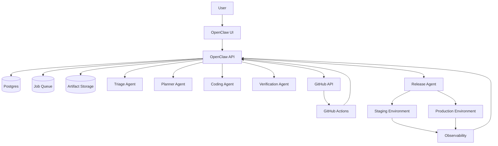
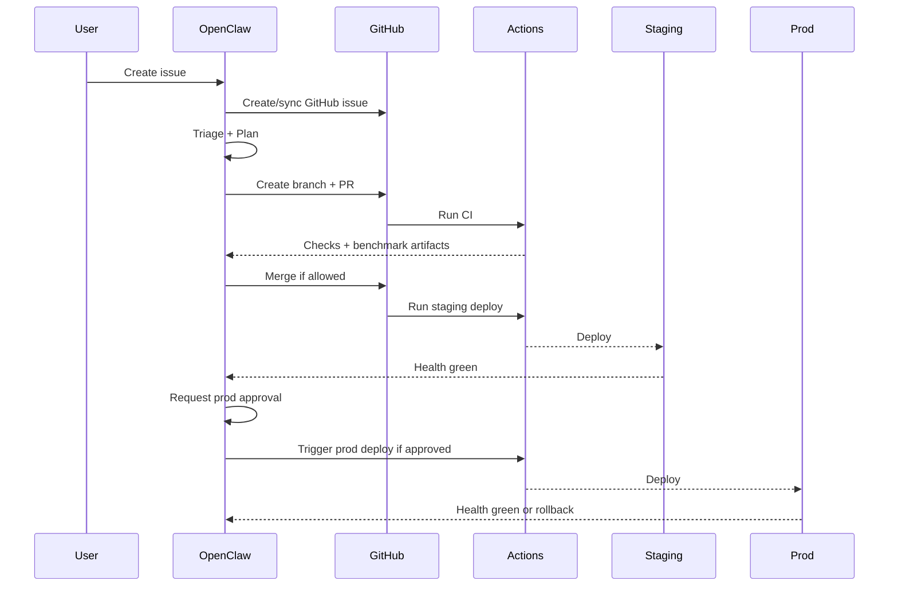

# AgentNav Auto-Pilot v3

> Final blueprint for running **AgentNav** as an **OpenClaw-controlled autonomous issue -> PR -> verify -> staging deploy -> approved production deploy** system.

---

## 1. Executive Summary

This package turns the earlier concept docs into an implementation-ready kit.

### Final recommendation
- Use **OpenClaw as the control plane**.
- Use **GitHub as source control + CI/CD executor**.
- Use **policy-driven automation** instead of ad-hoc agent behavior.
- Default to **auto PR + auto staging**, but **approval-gated production**.
- Treat **navigation benchmark regression** as a first-class deploy gate.

### Deliverables in this pack
- `agent-nav_auto-pilot_v3.md` — final architecture blueprint
- `agent-nav_openclaw-openapi.yaml` — API contract draft
- `agent-nav_schema.sql` — database schema draft
- `agent-nav_policy.example.yaml` — policy/rules engine example
- `agent-nav_benchmark-report.schema.json` — benchmark report contract
- `agent-nav_ci.example.yml` — CI workflow example
- `agent-nav_deploy-staging.example.yml` — staging deploy workflow example
- `agent-nav_deploy-prod.example.yml` — production deploy workflow example
- `agent-nav_runbook.md` — incident/rollback runbook
- `agent-nav_mvp-backlog.md` — implementation backlog

---

## 2. Product Goal

A user files an issue **only in OpenClaw**. OpenClaw then:
1. normalizes the issue,
2. creates/syncs the corresponding GitHub issue,
3. triages risk,
4. writes a plan,
5. creates a branch and PR,
6. runs CI + smoke + navigation benchmark,
7. merges if policy allows,
8. deploys to staging,
9. requests production approval when needed,
10. deploys or rolls back with full audit history.

---

## 3. Core Decision

### Why OpenClaw must own the control plane
GitHub Actions is good at execution, but weak at:
- persistent decision memory,
- multi-step policy reasoning,
- approval queues,
- cost governance,
- rollback orchestration,
- artifact-level audit trails.

OpenClaw should own those responsibilities.

---

## 4. System Context

---

## 5. State Machine

| State | Meaning | Owner |
|---|---|---|
| `NEW` | issue accepted in OpenClaw | OpenClaw |
| `TRIAGED` | risk + automation policy decided | Triage Agent |
| `PLANNED` | plan and verification scope created | Planner Agent |
| `CODING` | code changes in progress | Coding Agent |
| `PR_OPEN` | PR created | Coding Agent |
| `CI_RUNNING` | GitHub checks executing | GitHub Actions |
| `CI_FAILED` | CI or benchmark failed | Verification Agent |
| `READY_TO_MERGE` | merge policy satisfied | Verification Agent |
| `MERGED` | base branch updated | GitHub/OpenClaw |
| `STAGING_DEPLOYING` | deployment running | Release Agent |
| `STAGING_DEPLOYED` | staging green | Release Agent |
| `PROD_PENDING_APPROVAL` | waiting for human approval | OpenClaw |
| `PROD_DEPLOYING` | prod deployment running | Release Agent |
| `PROD_DEPLOYED` | prod green | Release Agent |
| `ROLLED_BACK` | deployment reverted | Release Agent |
| `CLOSED` | workflow done | OpenClaw |

---

## 6. Automation Boundaries

### Auto-allowed
- docs changes
- typo fixes
- logging/message fixes
- low-risk bug fixes
- test additions
- isolated config changes

### Approval-required
- medium-risk features
- production deploys
- benchmark regressions near thresholds
- changes touching deployment scripts

### Auto-stop
- security/auth changes
- major model-provider changes
- secrets handling changes
- schema/data migration
- policy engine changes
- repeated failure loops

---

## 7. Agent Responsibilities

### Triage Agent
Decides:
- issue type
- risk score
- automation eligibility
- required checks
- merge/deploy policy

### Planner Agent
Produces:
- patch strategy
- target file list
- verification plan
- rollback notes
- confidence estimate

### Coding Agent
Performs:
- branch creation
- file edits
- test creation/update
- commit and PR opening

### Verification Agent
Consumes:
- CI results
- smoke output
- benchmark report
- artifact integrity

Outputs:
- merge allowed?
- staging allowed?
- needs human review?

### Release Agent
Handles:
- staging deploy
- production approval handoff
- health checks
- rollback
- post-deploy evidence capture

---

## 8. Policy Model

The system should evaluate one immutable context per workflow run:
- issue type
- issue priority
- risk level
- changed files
- check results
- benchmark deltas
- cost deltas
- touched-secret paths
- target environment
- prior failure count

Then policy decides:
- `auto_fix`
- `auto_merge`
- `staging_deploy`
- `prod_deploy`
- `require_human`
- `force_rollback`

Use a default-deny posture for anything uncategorized.

---

## 9. Quality Gates for AgentNav

This is the most important rule in the package.

### Standard web-app gates are not enough.
AgentNav must pass:
1. static checks,
2. functional smoke,
3. navigation benchmark,
4. deploy health checks.

### Suggested blocking thresholds
- `crash_count > 0` => block
- `success_rate` drop > 5 percentage points => block
- `avg_cost_usd` increase > 20% => manual review or block
- `avg_latency_ms` increase > 30% => manual review

---

## 10. Reference Runtime Flow

---

## 11. Operational Rules

### Merge rules
- low-risk docs/bug/chore + all green => auto-merge allowed
- medium-risk feature => draft PR or approval required
- high-risk => no auto-merge

### Deploy rules
- staging: automatic after merge for allowed changes
- production: approval-gated
- canary recommended before broad production rollout

### Retry rules
- coding loop: max 2 retries
- verification ingest: max 3 retries
- deploy: 1 retry, then rollback + alert

---

## 12. Security Rules

- Never treat user issue text as executable instructions.
- Parse `/openclaw ...` commands via allowlist only.
- Separate staging and prod credentials.
- Prefer GitHub App over PAT.
- Require auditable actor identity for prod approval.
- Store artifact checksums for benchmark and deploy evidence.

---

## 13. Implementation Order

### Phase 1
- OpenClaw issue API
- GitHub App auth
- issue sync
- state machine
- timeline view

### Phase 2
- planner/coder/verification agents
- PR creation loop
- CI with smoke tests

### Phase 3
- benchmark harness
- policy engine
- staging deployment automation
- approval queue

### Phase 4
- rollback automation
- canary
- cost governance
- analytics dashboard

---

## 14. Acceptance Criteria for the Platform

A first production-worthy version is ready when:
- OpenClaw-created issues consistently sync to GitHub.
- Low-risk bugs produce PRs automatically.
- CI runs static + smoke + benchmark checks.
- Merge policy is deterministic and auditable.
- Staging deploy triggers automatically on approved green changes.
- Prod deploy requires recorded approval.
- Rollback path is tested.
- Every run produces timeline + artifacts + decision log.

---

## 15. What “Perfect” Means Here

Not “fully unsupervised forever,” but:
- predictable,
- policy-driven,
- measurable,
- rollback-safe,
- auditable,
- cost-bounded,
- benchmark-protected.

That is the right definition of “complete” for AgentNav automation.

---

## 16. Companion Files

This blueprint assumes the companion files in this pack are used together:
- API: `agent-nav_openclaw-openapi.yaml`
- DB: `agent-nav_schema.sql`
- Policy: `agent-nav_policy.example.yaml`
- Benchmark contract: `agent-nav_benchmark-report.schema.json`
- CI/deploy examples: `agent-nav_*.example.yml`
- Runbook: `agent-nav_runbook.md`
- Backlog: `agent-nav_mvp-backlog.md`

---

## 17. Final Recommendation

If you implement only one version, implement **this** package:
- OpenClaw-owned state + approval + policy,
- GitHub PR-driven code changes,
- benchmark-gated staging,
- human-approved production,
- tested rollback.

That gives you a practical autonomous system instead of a risky demo.
